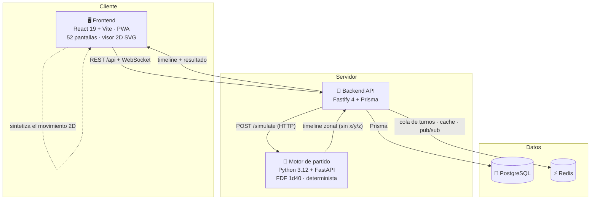

<div align="center">

# ⚽ Manager FDF

**Un manager de fútbol online, multijugador y persistente — fiel al clásico FDF, modernizado para la web.**

Dirige tu club, prepara la táctica, ficha, gestiona la economía y la cantera, y vive cada partido en un visor 2D cenital reproducido por un motor de simulación determinista.

<br/>


</div>

---

## 📖 ¿Qué es Manager FDF?

**Manager FDF** es un juego de manager de fútbol online y multijugador persistente, inspirado en los clásicos (PC Fútbol / Championship Manager) pero reconstruido para la web. Cada jugador dirige **un único club** —táctica, alineaciones, fichajes, economía, cantera, entrenamiento y estadio— con equipos y ligas reales de Europa y Sudamérica.

El mundo **avanza en tiempo real por turnos**: dos *ticks* diarios (11:00 y 23:00, Europe/Madrid) hacen progresar varios días de juego. Las decisiones se preparan antes; solo la resolución de los partidos espera al turno. Se compite en ligas, copas y torneos internacionales (Champions, Libertadores, UEFA/Sudamericana, Intercontinental, Mundial y selecciones) a lo largo de temporadas encadenadas.

**Filosofía de diseño:** fiel al FDF original, **un club por persona**, **cero pay-to-win** y **todo auditable por semilla determinista** (el "Túnel del Tiempo": revivir cualquier partido histórico re-simulándolo por su semilla → resultado idéntico, bit a bit).

---

## ✨ Características

| Área | Descripción |
|------|-------------|
| ⚙️ **Motor FDF (1d40 por fases)** | Simulador **determinista por semilla** que replica el manual: cada jugada se resuelve fase a fase con una tirada 1d40 contra un valor de fase (atributos atacante vs defensor, marcador vivo, confianza). Playbook generativo por formación. |
| 🎬 **Visor de partido 2D** | Retransmisión cenital **SVG + CSS a 60 fps** que sintetiza el *timeline* zonal del motor: balón y bloques de jugadores, cámara *broadcast* suavizada, celebraciones de gol y moviola con la anatomía del gol. |
| 🧩 **Tácticas y alineaciones** | 14-15 formaciones, posiciones detalladas (15 roles), estilo de juego *piedra-papel-tijera*, zonas de ataque, refuerzos por carril, jugadas ensayadas y sustituciones condicionales. Pizarra con *drag & drop*. |
| 👥 **Plantilla y entrenamiento** | Atributos por posición, talento/techo, moral, forma física y cansancio; contratos y cláusulas; entrenamiento semanal por grupos y desarrollo de jugadas. |
| 💸 **Mercado y fichajes** | Ventanas de mercado, negociación con clubes e IA, cláusulas, cesiones, anti-reventa, **subastas en tiempo real** y sala de operaciones. |
| 🏛️ **Economía e institución** | Caja, taquilla y masa social, derechos de imagen, **mercado de acciones**, estadio e instalaciones, ciudad deportiva y personal del club. |
| 🌱 **Cantera y afición** | Residencias que generan canteranos según ciudad/país e ideología, promoción de categorías, pirámide social y campañas de afición. |
| 🌍 **Competiciones y mundo** | Ligas (Europa y Sudamérica con divisiones), copas, competiciones continentales, Mundial, selecciones, calendario y memoria del mundo (palmarés, récords, leyendas). |
| 📈 **Progresión del mánager** | Prestigio, valoración FDF, contratos por objetivos y árbol de carrera (XP, ramas táctica/motivación/finanzas) — mejoras **sin pay-to-win**. |
| 💬 **Social y comunidad** | Chat, mensajes privados, foro, prensa, noticias, premios y elecciones, con notificaciones *web-push*. |
| 🌐 **Multi-idioma y PWA** | Interfaz internacionalizada en **5 idiomas** (es/en/fr/de/it), instalable como PWA y *mobile-first*. |

---

## 🏛️ Arquitectura

Tres servicios desacoplados sobre PostgreSQL + Redis. El motor **no emite coordenadas**: emite un *timeline zonal* y el frontend **sintetiza** el movimiento de los 22 jugadores y el balón de forma determinista.



**Flujo de un turno:** el cron del backend dispara el *tick* → `processTick` avanza el calendario y resuelve cada jornada llamando al motor Python (con un **motor de respaldo en TypeScript** si el motor está dormido/lento) → los resultados se persisten en PostgreSQL y se difunden por WebSocket → el frontend reproduce cada partido en el visor 2D a partir del *timeline* determinista.

---

## 🧰 Stack tecnológico

| Capa | Tecnologías |
|------|-------------|
| **Frontend** | React 19 · TypeScript · Vite 8 · Tailwind CSS 4 · Zustand 5 · React Router 7 · i18next (5 idiomas) · Recharts · facesjs · dnd-kit · three.js *(solo mapa/visor 3D)* · PWA (Workbox) |
| **Backend** | Fastify 4 · Prisma 5 · PostgreSQL 16 · Redis (ioredis) · JWT (`@fastify/jwt`) + bcryptjs · node-cron · WebSockets (`@fastify/websocket`) · web-push (VAPID) · Zod · Pino |
| **Motor de partido** | Python 3.12 · FastAPI · Uvicorn · Pydantic v2 *(runtime solo stdlib; NumPy únicamente para calibración)* |
| **Infra / calidad** | Docker Compose · GitHub Actions (CI) · Playwright (e2e) · Vitest (unit) · pytest (motor) · ESLint |
| **Despliegue** | Vercel (web) · Koyeb (API) · Fly.io (motor) · Neon (Postgres) · Upstash (Redis) |

---

## 📂 Estructura del repositorio

```text
Manager fdf/
├── football-manager/              # Aplicación principal
│   ├── src/                       # Frontend React 19 + TS (52 pantallas, stores Zustand, visor 2D)
│   │   ├── api/                   # Cliente REST tipado (src/api/client.ts) + WebSocket (src/lib/ws.ts)
│   │   ├── lib/                   # Síntesis del visor: matchAnimation.ts, pitchMovement.ts
│   │   ├── components/match/      # MatchCenter / Pitch2D (visor de partido)
│   │   └── i18n/                  # es / en / fr / de / it
│   ├── server/                    # Backend API — Fastify 4 + Prisma + PostgreSQL + Redis
│   │   ├── src/modules/           # ~45 módulos de dominio (auth, market, matches, game/tick, ...)
│   │   └── prisma/                # schema.prisma (116 modelos) + seeds
│   ├── engine/                    # Motor de partido — Python 3.12 + FastAPI (FDF 1d40)
│   │   ├── app/                   # engine.py, models.py, main.py, fdf_playbook.py, ...
│   │   └── tests/                 # 137 tests (pytest)
│   ├── e2e/                       # Tests end-to-end (Playwright)
│   ├── tests/                     # Tests unitarios de librería (Vitest)
│   ├── docker-compose.yml         # Stack base: postgres + redis + backend + engine
│   ├── docker-compose.dev.yml     # Overlay de desarrollo: Vite HMR + puertos expuestos
│   ├── vercel.json                # Despliegue del frontend
│   └── .env.example               # Plantilla de variables de entorno (no contiene secretos)
├── docs/                          # Documentación de diseño y mecánicas
└── .github/workflows/ci.yml       # CI: lint · build · tests · build de imagen Docker
```

---

## 🚀 Puesta en marcha

### Requisitos previos

- **Docker** y **Docker Compose** (vía recomendada), **o**
- **Node.js 20+** y **npm**, **Python 3.12** y un **PostgreSQL** + **Redis** locales (vía manual).

> Toda la aplicación vive en `football-manager/`. Ejecuta los comandos desde ahí salvo que se indique lo contrario.

### 1) Variables de entorno

```bash
cd football-manager
cp .env.example .env
```

Edita `.env` y rellena los secretos reales. Como mínimo:

- `JWT_SECRET` — **≥ 32 caracteres** (genera uno con `openssl rand -hex 32`)
- `POSTGRES_PASSWORD`, `REDIS_PASSWORD`
- `DATABASE_URL`, `DIRECT_URL`, `REDIS_URL`
- `MASTER_PASSWORD` / `ADMIN_PASSWORD` / `FIFA_PASSWORD` / `DEMO_PASSWORD` (cuentas de staff iniciales)

> ⚠️ **Nunca subas tu `.env` a git.** Está cubierto por `.gitignore`. La plantilla `.env.example` (sin secretos) sí se versiona.

### Opción A — Docker (recomendada, stack completo)

Levanta frontend (Vite HMR), backend, motor Python, PostgreSQL y Redis de una vez:

```bash
cd football-manager
docker compose -f docker-compose.yml -f docker-compose.dev.yml up
```

El backend ejecuta automáticamente `prisma db push` + *seed* en desarrollo. Cuando termine de arrancar:

| Servicio | URL |
|----------|-----|
| Frontend | http://localhost:5173 |
| API      | http://localhost:8081/api |
| Motor    | http://localhost:8000/health |
| Postgres | `localhost:5432` |
| Redis    | `localhost:6379` |

Para un stack **tipo producción** (el backend sirve el frontend ya compilado, sin HMR) usa solo `docker compose up`.

### Opción B — Manual (tres procesos)

Con un PostgreSQL y un Redis ya en marcha y `DATABASE_URL` / `REDIS_URL` apuntando a ellos:

```bash
# 1) Motor de partido (Python)
cd football-manager/engine
python -m venv venv && source venv/bin/activate
pip install -r requirements.txt
uvicorn app.main:app --host 0.0.0.0 --port 8000      # comprueba http://localhost:8000/health

# 2) Backend (en otra terminal)
cd football-manager/server
npm ci
npx prisma generate
npx prisma db push          # crea el esquema (o `npm run db:migrate` para migraciones versionadas)
npm run db:seed:dev         # datos iniciales (clubes, ligas, jugadores...)
npm run db:ensure-roles:dev # cuentas de staff (opcional)
npm run dev                 # API en http://localhost:3001  (ENGINE_URL=http://localhost:8000)

# 3) Frontend (en otra terminal)
cd football-manager
npm ci
# VITE_API_URL=http://localhost:3001/api
npm run dev                 # http://localhost:5173
```

Inicia sesión con una de las cuentas sembradas (las contraseñas son las que definiste en `.env`).

### Variables de entorno (resumen)

Agrupadas como en `football-manager/.env.example`:

| Grupo | Variables |
|-------|-----------|
| Modo | `NODE_ENV` |
| Auth | `JWT_SECRET`, `JWT_EXPIRES_IN` |
| Base de datos | `DATABASE_URL`, `DIRECT_URL`, `POSTGRES_USER`, `POSTGRES_PASSWORD`, `POSTGRES_DB` |
| Redis | `REDIS_URL`, `REDIS_PASSWORD` |
| Cuentas de staff | `MASTER_PASSWORD`, `ADMIN_PASSWORD`, `FIFA_PASSWORD`, `DEMO_PASSWORD`, `RUN_DB_SEED`, `ENSURE_STAFF_ROLES` |
| Motor de turnos | `TICK_CRON_T1`, `TICK_CRON_T2`, `TICK_ENABLED`, `TZ` |
| API | `API_PORT`, `CORS_ORIGINS` |
| Motor de partido | `ENGINE_URL`, `ENGINE_API_KEY`, `ENGINE_TIMEOUT_MS`, `ENGINE_BATCH_MS_PER_MATCH` |
| Frontend (Vite) | `VITE_API_URL` |
| Web Push (VAPID) | `VAPID_PUBLIC_KEY`, `VAPID_PRIVATE_KEY`, `VAPID_SUBJECT` |
| Cola de turnos endurecida (prod) | `TICK_QUEUE`, `TICK_WEBHOOK_SECRET`, `TICK_QUEUE_MAX_ATTEMPTS`, `TICK_QUEUE_RETRY_MS`, `TICK_QUEUE_LOCK_TTL_S` |

---

## 🧪 Tests y calidad

```bash
# Frontend
cd football-manager
npm run lint            # ESLint
npm run build           # tsc -b && vite build
npm run test:e2e        # Playwright (Chromium + Pixel 7)

# Backend
cd football-manager/server
npm test                # Vitest

# Motor
cd football-manager/engine
pytest                  # 137 tests (engine, API, batch, lanes/chain, styles, subs, límites...)
python calibrate.py 20000   # calibración Monte Carlo (~2,7 goles/partido)
```

La **CI** (`.github/workflows/ci.yml`, en *push*/PR a `main` y `develop`) corre cuatro *jobs*: `frontend` (lint + build), `backend` (Postgres + Redis efímeros → prisma + build + Vitest), `e2e` (Playwright) y `docker` (verifica el *build* de la imagen del backend).

---

## 🌍 Despliegue

Objetivo de producción de **coste cero** repartiendo cada pieza en su plataforma (ver `docs/DESPLIEGUE.md`):

| Componente | Plataforma | Cómo |
|------------|-----------|------|
| Frontend | **Vercel** | `vercel.json` (root = `football-manager`, `VITE_API_URL` → API + `/api`) |
| Backend API | **Koyeb** | imagen Docker (`server/Dockerfile.backend`) |
| Motor | **Fly.io** | `engine/Dockerfile` + `engine/fly.toml` (Madrid, *scale-to-zero*) |
| PostgreSQL | **Neon** | Postgres serverless (`DATABASE_URL` *pooled* + `DIRECT_URL`) |
| Redis | **Upstash** | Redis sobre TLS (`rediss://`) |

> El backend incluye un **motor de respaldo en TypeScript**, así que un *cold start* del motor en Fly.io nunca rompe un turno.

---

## 🎮 Cómo se juega (ciclo)

1. **Antes del turno** — revisa el centro de mando del club, atiende el *checklist* de decisiones y prepara el partido: once, formación, estilo, zonas de ataque, refuerzos, jugadas ensayadas y sustituciones condicionales.
2. **Entre turnos (24/7)** — negocia fichajes y renovaciones, programa el entrenamiento de plantilla y cantera, equilibra la economía y amplía estadio e instalaciones.
3. **Al pasar el turno** — el motor resuelve los partidos de forma determinista y los revives en el **visor 2D**. Según resultados, objetivos y operaciones sube o baja tu prestigio y valoración FDF.
4. **A lo largo de la temporada** — ascensos/descensos, copas y títulos reabren el ciclo y escalan tu carrera de mánager.

---

## ⚽ El motor FDF y el visor 2D

- **Motor (Python):** única fuente de verdad sobre *qué pasó*. Replica el manual FDF §1.1–1.3: ~42 jugadas/partido por equipo, cada una resuelta **fase a fase** con una tirada **1d40** contra un valor de fase. Calibrado a ~2,7 goles/partido. **Determinista por semilla** (RNG principal + RNGs derivadas para narrativa/lesiones que no alteran el marcador). Emite un *timeline* zonal de ~15–40 momentos `{minute, phase, team, zone, lane?, duel?, chain?}` — **sin x/y/z, sin velocidad, sin ticks**.
- **Visor (React):** presentación pura. Lee el *timeline* y **sintetiza** el movimiento de los 22 jugadores + balón en SVG/CSS a 60 fps: interpolación por jugada, bloque de equipo que bascula, defensor del duelo con su pose, física de balón (comba Magnus, vuelo y bote), cámara *broadcast* y moviola del gol. Nunca contradice el marcador, el goleador ni la zona del motor.

Más detalle en [`docs/MOTOR-FDF-1D40.md`](docs/MOTOR-FDF-1D40.md), [`docs/VISOR-PARTIDO-2D.md`](docs/VISOR-PARTIDO-2D.md) y [`football-manager/engine/README.md`](football-manager/engine/README.md).

---

## 📚 Documentación

| Documento | Contenido |
|-----------|-----------|
| [docs/manual-managerfdf-referencia.md](docs/manual-managerfdf-referencia.md) | Biblia de mecánicas FDF (motor, tácticas, mercado, economía, cantera, competiciones). |
| [docs/MOTOR-FDF-1D40.md](docs/MOTOR-FDF-1D40.md) | El simulador determinista por fases (1d40) y el playbook por formación. |
| [docs/VISOR-PARTIDO-2D.md](docs/VISOR-PARTIDO-2D.md) | Arquitectura del visor 2D: flujo de datos, contrato del *timeline*, movimiento y cámara. |
| [docs/CENTRO-DE-MANDO-CLUB.md](docs/CENTRO-DE-MANDO-CLUB.md) | Portada privada del club: foco operativo, KPIs y accesos por departamento. |
| [docs/DEPARTAMENTO-DEPORTIVO.md](docs/DEPARTAMENTO-DEPORTIVO.md) | Espacio deportivo: Plantilla, Táctica y Entrenamiento. |
| [docs/NAVEGACION-Y-CENTROS-DE-AREA.md](docs/NAVEGACION-Y-CENTROS-DE-AREA.md) | Navegación global y centros de mando por área. |
| [docs/RETRATOS-JUGADORES.md](docs/RETRATOS-JUGADORES.md) | Retratos faciales deterministas con envejecimiento y camiseta del club. |
| [docs/diseno-posiciones-y-formaciones.md](docs/diseno-posiciones-y-formaciones.md) | Diseño de posiciones, roles y formaciones. |
| [docs/FORMACIONES-JUGADAS-Y-HABILIDADES.md](docs/FORMACIONES-JUGADAS-Y-HABILIDADES.md) | Catálogo de jugadas por formación y habilidades por posición. |
| [docs/DESPLIEGUE.md](docs/DESPLIEGUE.md) | Guía de despliegue (Vercel / Koyeb / Fly / Neon / Upstash). |

---

## 🗺️ Estado del proyecto

**En desarrollo avanzado, camino a beta.** Madurez aproximada: **Motor ~99 % · Backend ~97 % · Frontend ~94 %**. La mayoría de bloques están cerrados con *gates* en verde (`tsc` 0, `pytest` del motor en verde, *build* OK, `lint` 0). Pendiente: estadísticas y *rankings* globales, auditoría de fidelidad al manual (incl. ampliar Sudamérica/Libertadores), i18n completo, QA de dos temporadas y la fase de despliegue/beta.

---

## 📄 Licencia

**© 2026 Jaime Torres Pastor — Todos los derechos reservados.**

Repositorio **propietario**, publicado únicamente con fines de demostración y consulta (p. ej. evaluación por parte de entrevistadores). No se concede permiso para copiar, modificar, distribuir ni reutilizar el código. Ver [`LICENSE`](LICENSE).

---

<div align="center">

Hecho con ⚽ y código determinista.

</div>
